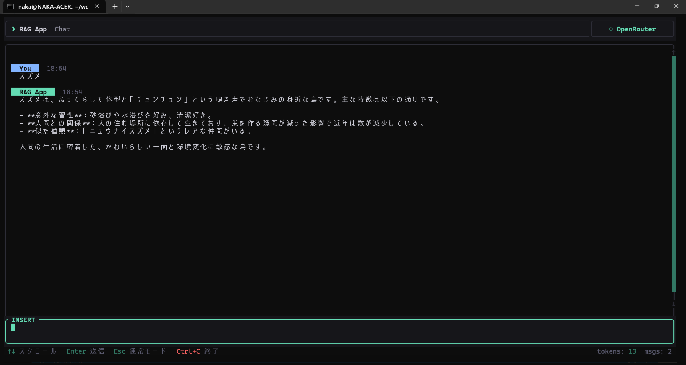

# rust_tui_rag_4

 Version: 0.9.2

 date    : 2026/06/14 

 update : 2026/07/10

***

Rust C++ , Ratatui RAG SQLite TUI

* OpenRouter
* embedding : Gemini-embedding-001
* LLVM CLang
* Linux

***
### vector data add

https://github.com/kuc-arc-f/rust_cpp1/tree/main/rs_rag_1

***
## Image

* RAG APP



***
### related

https://openrouter.ai/

https://openrouter.ai/models

***
* LIB add
```
sudo apt install uuid-dev
sudo apt install nlohmann-json3-dev
sudo apt install libsqlite3-dev
sudo apt install libcurl4-openssl-dev
```
***
* example.db
* rs_rag_1/example.db , db file copy

***
* .env

```
LD_LIBRARY_PATH=.
GEMINI_API_KEY=your-key
OPENROUTER_API_KEY=your-key
OPENROUTER_MODEL=deepseek/deepseek-v4-flash
```

***
* build
```
make all
cargo build
cargo run
```

***
* UI operate
* edit mode: e key
* quit: Esc key , q

***
### blog

https://zenn.dev/knaka0209/scraps/65381f12905d8c

***
### version

* V_0_9_1: new

***